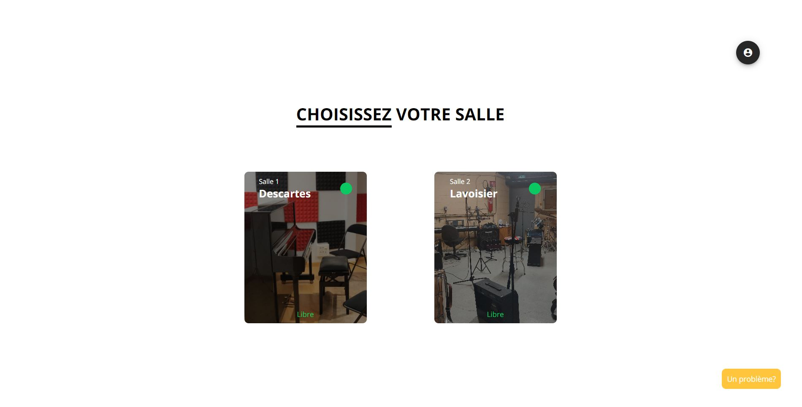
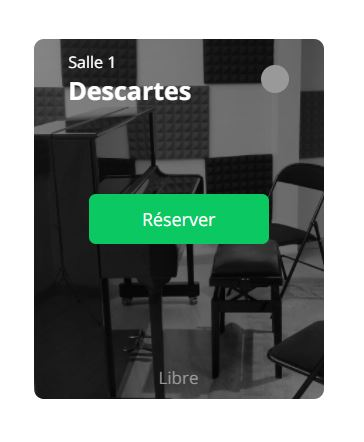
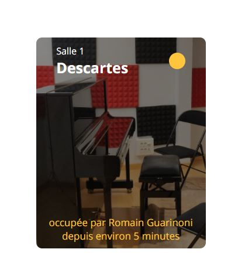
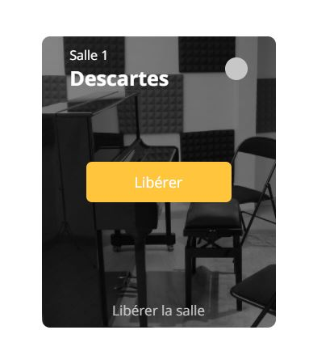

# letsJamIMT

**le site :** [click here](https://letsjamimt.herokuapp.com)

Ce site permet de gérer la réservation des salles de musiques de l'école IMT Lille Douai simplement .

## Comment ça marche ?

1. **Créer un compte**

Sur la page de connexion du site, rentrer juste votre _nom_ ainsi que votree _prenom_ pour créer votre compte

2. **Réserver une salle**

   1. Si la salle est libre, vous pouvez cliquer sur le bouton réserver en passant la souris sur la salle ou en cliquant sur la salle ( quand on est sur télephone ou tablette)
      

   2. Si la salle est prise, il faut attendre que son utilisateurs la libèrent. Les salles se libèrent automatiquement au bout de 2 heures.
      

3. **Rendre la salle**

Pour rendre la salle, passez la souris au dessus de la salle et cliquez sur le bouton _libérer_ ou cliquez sur la salle ( quand on est sur télephone ou tablette)

## Pas besoin de raffraichir la page !

Ce site web marche avec les websockets, autremement dit, toutes les infos des salles se mettent a jour toutes seuls sans que vous ayez a raffraichir la page !
